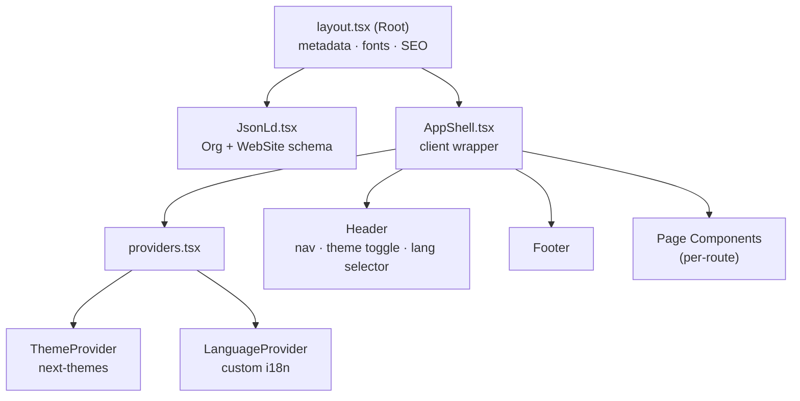
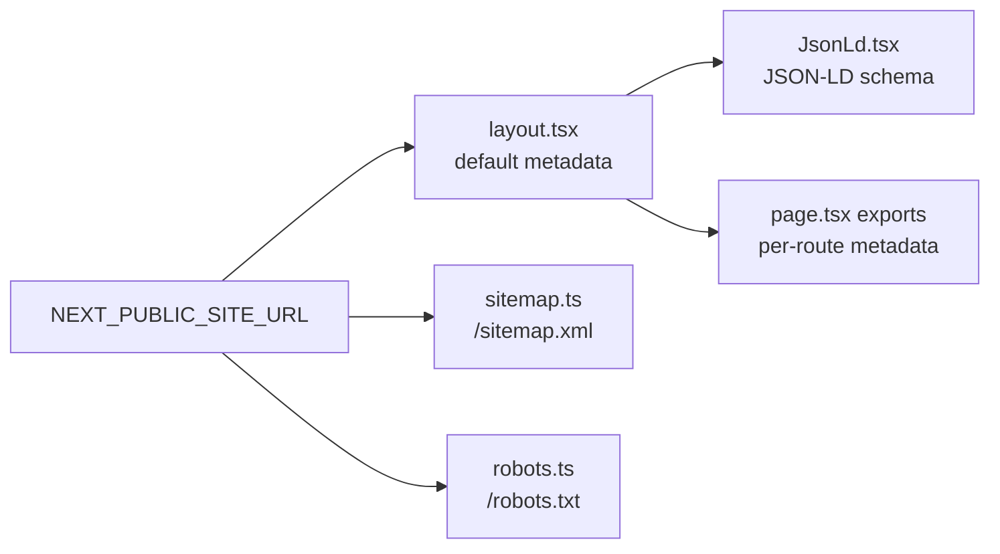

# ARCHITECTURE — Codebase Skeleton

> [!note]
> This file maps **structure**. For brand, stack, and colors, see [[OVERVIEW]]. For wiki rules, see [[SCHEMA]].

---

## App Layout Hierarchy

Every page is wrapped in this chain. Understanding it prevents confusion about where to add providers, layout elements, or global state.



---

## Folder Map

### `src/app/` — Routes

```
src/app/
├── layout.tsx              ← Root layout: metadata, fonts, AppShell
├── page.tsx                ← / (Home)
├── AppShell.tsx            ← Client wrapper: Header + Footer + providers
├── providers.tsx           ← ThemeProvider + LanguageProvider
├── JsonLd.tsx              ← Structured data (Organization + WebSite schema)
├── sitemap.ts              ← Generates /sitemap.xml
├── robots.ts               ← Generates /robots.txt
│
├── about/                  ← /about
├── blog/                   ← /blog
├── blog-details/           ← /blog-details
├── blog-sidebar/           ← /blog-sidebar
├── contact/                ← /contact
├── exports/                ← /exports
├── markets/                ← /markets
├── products/               ← /products
├── technology/             ← /technology
├── proveedores/            ← /proveedores
│
├── apply/credit/           ← /apply/credit — [[features/credit-application|credit application]]
├── client-portal/          ← /client-portal — [[features/client-portal|client portal]]
│   └── layout.tsx          ← Portal-specific layout
├── proveedor-portal/       ← /proveedor-portal — [[features/proveedor-portal|proveedor portal]]
│
├── auth/                   ← Auth — [[features/auth|auth]]
│   ├── layout.tsx
│   ├── login/              ← redirects to clientes/login
│   ├── clientes/
│   │   ├── login/
│   │   └── register/
│   ├── proveedores/
│   │   ├── login/
│   │   └── register/
│   ├── forgot-password/
│   ├── reset-password/
│   └── verify-email/
├── signin/
├── signup/
├── error/
│
└── api/
    ├── auth/callback/      ← Supabase OAuth callback (route.ts)
    └── apply/credit/       ← Credit form API handler (route.ts)
```

### `src/components/` — UI Modules

24 feature folders, each co-located with its data files (e.g., `menuData.tsx`, `featuresData.tsx`).

| Folder | Connected Route / Feature |
|--------|--------------------------|
| `About/` | `/about` |
| `Blog/` | `/blog` |
| `Brands/` | Home — brand logo strip |
| `ClientPortal/` | [[features/client-portal|client portal]] |
| `ProveedorPortal/` | [[features/proveedor-portal|proveedor portal]] |
| `Common/` | Shared utilities: SectionTitle, buttons, **`Select`** (styled `<select>` for Farm forms), etc. |
| `Farm/` | [[features/proveedor-portal|Mi Finca]] catalog editors under `/proveedor-portal/farm/catalogos/*` |
| `Contact/` | `/contact` |
| `ContactSection/` | Inline contact blocks used across pages |
| `CreditApplication/` | [[features/credit-application|credit application]] |
| `Exports/` | `/exports` |
| `Features/` | Home — features section |
| `Footer/` | Global footer |
| `Header/` | Global header: nav, [[features/theme-toggler|ThemeToggler]], [[features/language-selector|LanguageSelector]] |
| `Hero/` | Home — hero section |
| `LanguageSelector/` | Language switcher UI |
| `Markets/` | `/markets` |
| `Pricing/` | Pricing section |
| `Products/` | `/products` |
| `Proveedores/` | `/proveedores` |
| `ScrollToTop/` | Back-to-top button |
| `Sustainability/` | Sustainability content block |
| `Testimonials/` | Testimonials section |
| `UpcomingTools/` | Placeholder for future tools — see [[roadmap/index]] |
| `Video/` | Video section |

### `src/lib/` — Utilities

| File / Folder | Purpose |
|---------------|---------|
| `translations.ts` | All i18n strings (~1700 lines) for en / es / ru / zh |
| `i18n.ts` | Language type definitions and supported locale list |
| `supabase/client.ts` | Browser Supabase client (anon key) |
| `supabase/server.ts` | Server Supabase client — reads cookies for SSR |
| `supabase/admin.ts` | Service-role admin client — **server only** |
| `farm/*.ts` | Mi Finca data helpers (`clases`, `variedades`, `actividades`, `ciclos`, `insumos`, `ubicaciones`) — used by server pages + client editors |

### `src/contexts/`

| File | Purpose |
|------|---------|
| `LanguageContext.tsx` | [[features/language-context|LanguageContext]] — `t`, `language`, `setLanguage` |

### `src/styles/`

| File | Purpose |
|------|---------|
| `index.css` | Tailwind v4 `@theme` block: brand color tokens, custom breakpoints, typography, scrollbar |

---

## Route Table

### Public Pages

| Route | Component Folder | Notes |
|-------|-----------------|-------|
| `/` | `Hero/`, `Features/`, `Brands/`, etc. | Home — assembled from multiple components |
| `/about` | `About/` | Company story and team |
| `/products` | `Products/` | Hydrangea catalog |
| `/exports` | `Exports/` | Export process and certifications |
| `/markets` | `Markets/` | Target international markets |
| `/technology` | — | Technology and process page |
| `/contact` | `Contact/` | Contact form |
| `/blog` | `Blog/` | Blog listing |

### Auth Routes → [[features/auth|auth]]

| Route | Purpose |
|-------|---------|
| `/auth/login` | Redirects to `/auth/clientes/login` |
| `/auth/clientes/login` | Customer portal login |
| `/auth/clientes/register` | Customer self-service signup (`role: cliente`) |
| `/auth/proveedores/login` | Supplier portal login |
| `/auth/proveedores/register` | Supplier self-service signup (`role: proveedor`) |
| `/auth/forgot-password` | Password reset request (`?back=` optional login URL) |
| `/auth/reset-password` | Password reset confirmation |
| `/auth/verify-email` | Resend verification (`?back=` optional login URL) |
| `/signin` | Legacy sign in page |
| `/signup` | Legacy sign up page |

### Portals & Tools

| Route | Feature Page | Status |
|-------|-------------|--------|
| `/client-portal` | [[features/client-portal|client portal]] | Gated — middleware + server `getUser` |
| `/proveedor-portal` | [[features/proveedor-portal|proveedor portal]] | Gated — middleware + server `getUser` |
| `/proveedor-portal/farm` and `/proveedor-portal/farm/catalogos/*` | [[features/proveedor-portal|proveedor portal]] § Mi Finca | Farm hub + catalogs (clases, ubicaciones, variedades, insumos, actividades, ciclos); other `farm/*` routes may be placeholders |
| `/proveedores` | [[features/proveedores|Proveedores]] | — |
| `/apply/credit` | [[features/credit-application|credit application]] | In development |

### API Routes

| Route | Handler | Purpose |
|-------|---------|---------|
| `/api/auth/callback` | `route.ts` | Supabase OAuth callback — exchanges code for session; `next` query defaults to `/client-portal` |
| `/api/apply/credit` | `route.ts` | Credit application form submission handler |

---

## SEO Layer



| File | Output | Notes |
|------|--------|-------|
| `layout.tsx` | `<head>` default metadata | Title template, OG, Twitter card, Google Search Console verification |
| `JsonLd.tsx` | `<script type="application/ld+json">` | Organization + WebSite structured data |
| `sitemap.ts` | `/sitemap.xml` | All public routes with absolute URLs |
| `robots.ts` | `/robots.txt` | Crawl rules, sitemap reference |
| Each `page.tsx` | Page-specific `<meta>` | Overrides root: title, description, canonical, OG image |

---

## Supabase / Database

**Data model (tables, relationships, RLS intent):** [[DATABASE]] — canonical map; this section only lists **code touchpoints**.

**Three Supabase clients — pick the right one:**

| Client | File | When to Use |
|--------|------|-------------|
| Browser | `supabase/client.ts` | Client components, browser-side queries |
| Server | `supabase/server.ts` | Server components, server actions (reads cookies) |
| Admin | `supabase/admin.ts` | API routes needing elevated access — **never in client code** |

Managed **`auth.*`** tables and any new **`public.*`** domains are described in [[DATABASE]] as they ship (e.g. credit applications — [[roadmap/index]]).

**Middleware:** `src/middleware.ts` matcher includes `/client-portal/:path*` and `/proveedor-portal/:path*`; session refresh in `src/lib/supabase/middleware.ts`.

---

## Breakpoints

Custom Tailwind breakpoints defined in `src/styles/index.css`:

| Name | Value |
|------|-------|
| `xs` | 450px |
| `sm` | 575px |
| `md` | 768px |
| `lg` | 992px |
| `xl` | 1200px |
| `2xl` | 1400px |

---

## Links

- [[OVERVIEW]] — brand, stack, colors, i18n
- [[DATABASE]] — Postgres tables and relationships
- [[SCHEMA]] — wiki maintenance rules
- [[features/auth|auth]] — sign-in, email verification, reset
- [[features/client-portal|client portal]]
- [[features/proveedor-portal|proveedor portal]]
- [[features/credit-application|credit application]]
- [[roadmap/index]] — upcoming work
- [[logs/session-2026-04-26]] — first session
