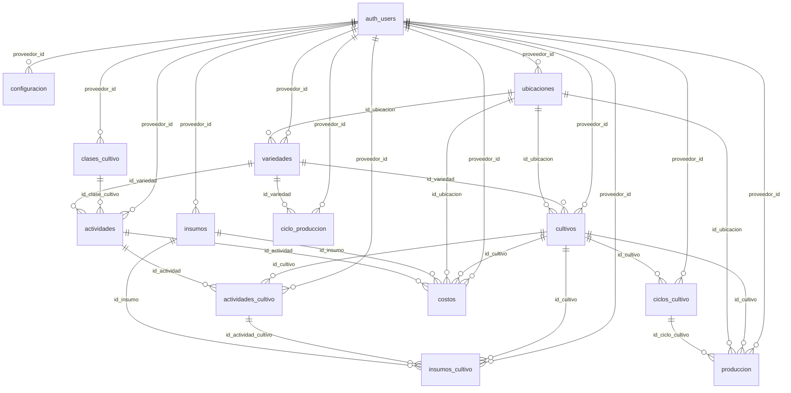

# DATABASE — Postgres & Supabase Data Map

> [!note] Purpose
> This page is the **single place** for how persisted data supports [[OVERVIEW|Flores Siberianas]]: which **tables** exist, how they **relate**, and **why** they exist. It is not a SQL dump — migrations and the Supabase dashboard remain the source of truth for exact types and constraints.

For sign-in flows and OAuth behaviour, see [[features/auth|auth]]. For where Supabase clients live in code, see [[ARCHITECTURE]].

---

## Why This Shape Exists

**One identity pool** (`auth.users`) serves both buyers and suppliers. **Role** lives in Postgres (`public.profiles`), not in parallel projects, so middleware and RLS can answer “who is this user?” in one query. **Rich profile fields** sit in role-specific tables so cliente and proveedor columns can evolve separately without overloading a single wide table.

---

## Schemas at a Glance

| Schema | Owned by | Purpose |
|--------|----------|---------|
| `auth` | Supabase | Accounts, sessions, tokens — do not mirror here in app migrations casually |
| `public` | App | Business-facing tables: roles, cliente/proveedor profiles, credit applications, and **Mi Finca** farm data (all `public` tables are documented below) |

---

## Entity Relationships

```mermaid
erDiagram
  auth_users ||--|| profiles : id
  profiles ||--o| clientes : id_matches
  profiles ||--o| proveedores : id_matches

  auth_users {
    uuid id PK
    string email
    jsonb raw_user_meta_data
  }

  profiles {
    uuid id PK_FK
    string role
  }

  clientes {
    uuid id PK_FK
    string nombres
    string apellidos
    string correo
    string numero_telefono
    string tipo_identificacion
    string numero_identificacion
  }

  proveedores {
    uuid id PK_FK
    string nombres
    string apellidos
    string correo
    string numero_telefono
    string tipo_identificacion
    string numero_identificacion
    text vereda
    text municipio
  }
```

Labels `auth_users`, `profiles`, etc. map to **`auth.users`** and **`public.*`** in Postgres.

### Farm domain (conceptual)

Every **Mi Finca** table carries **`proveedor_id`** → **`auth.users.id`** (same id as `proveedores.id`), with **RLS** so each proveedor only sees their own rows. Foreign keys between catalogs and operational rows mirror the legacy Google Sheet model (see `.cursor/PLAN_FARM_TO_PROVEEDORES.md` in the repo); exact FK graph lives in Supabase.



> [!tip]
> `clientes` and `proveedores` share the same **shape** in the product today; they are split so RLS and policies can enforce “only clientes rows when `profiles.role = cliente`” without ambiguity.

---

## Tables

### Supabase-managed (`auth`)

| Object | Purpose |
|--------|---------|
| `auth.users` | Canonical user id, email, encrypted password provider, `raw_user_meta_data` from signup (e.g. `role`, name fields) |
| `auth.sessions` | Session lifecycle for JWT refresh — used by Supabase client and middleware |

App code treats these as **opaque** except for `id`, `email`, and metadata keys the app sets at registration.

---

### Application (`public`)

There are **17** tables in `public` today (Supabase dashboard / `list_tables` is authoritative for names and RLS flags).

| Table | Purpose | Key columns (conceptual) |
|-------|---------|---------------------------|
| `profiles` | **Gate** every authenticated feature: one row per `auth.users` row, stores **portal role**. | `id` → `auth.users.id`; `role` ∈ `cliente` \| `proveedor` |
| `clientes` | **Buyer** profile for [[features/client-portal|client portal]] — legal/contact fields the marketing site does not need. | Same id as user; fields such as `nombres`, `apellidos`, `correo`, `numero_telefono`, `tipo_identificacion`, `numero_identificacion` |
| `proveedores` | **Supplier** profile for [[features/proveedor-portal|proveedor portal]] — parallel to `clientes` for growers; also anchors **Mi Finca** data. | Same id as user; plus `vereda`, `municipio` (location text); `correo`, `nombres`, `apellidos`, `tipo_identificacion`, `numero_identificacion`, `numero_telefono` |
| `credit_applications` | Submissions from the [[features/credit-application|credit application]] flow (company, contact, trade refs, uploads metadata). | See `src/app/api/apply/credit/route.ts` for fields written at insert time |

#### Mi Finca — catalogs, operations, costs (all tenant-scoped)

Each row includes **`proveedor_id`** → **`auth.users.id`** (with `on delete cascade`) and **RLS** so only that user can read/write. Defaults use `auth.uid()` on insert where applicable.

| Table | Purpose |
|-------|---------|
| `configuracion` | Per-proveedor key/value settings: `TASA_CAMBIO`, `SMMLV`, `JORNAL_DIA`, `HORAS_JORNAL` (seeded on proveedor signup). Composite PK `(proveedor_id, variable)`. |
| `clases_cultivo` | Crop class catalog (e.g. HORTENSIA, ROSA, CLAVEL); seeded per proveedor on signup. |
| `ubicaciones` | Physical locations (vereda, municipio, `area_m2`). Nullable `id_cultivo` / `nombre_cultivo` kept **sheet-aligned** (informational; many cultivos can still point at one ubicación via `cultivos.id_ubicacion`). |
| `insumos` | Supplies catalog (name, category, unit, `valor_unitario`, supplier name column, etc.). |
| `variedades` | Varieties per proveedor; optional FK `id_ubicacion` → `ubicaciones`; cycle and yield fields. |
| `actividades` | Activity templates; FKs to `clases_cultivo` and optionally `variedades`. |
| `ciclo_produccion` | Production **template** weeks per variety (`id_variedad`); `%` distribution across weeks. |
| `cultivos` | Individual crop runs / lots; FKs `id_ubicacion`, `id_variedad`; estado, dates, plant counts. |
| `ciclos_cultivo` | Materialized production cycles per cultivo (planned vs actual harvest, estado). |
| `actividades_cultivo` | Executed activities per cultivo; links to `actividades` template. |
| `insumos_cultivo` | Material lines per cultivo (and optionally per `actividades_cultivo`); links `insumos`. |
| `costos` | All monetary costs in one table; **`tipo_costo`** ∈ `MANO_OBRA` \| `INSUMO` \| `GENERAL` \| `OTRO`; optional FKs to ubicación, cultivo, insumo, actividad. |
| `produccion` | Harvest + sales in one row (`cantidad_cosechada`, `estado_venta`, buyer, prices, optional `id_ciclo_cultivo`). |

**Triggers (intent):** On `auth.users` insert, `handle_new_user` (or equivalent) creates `public.profiles` with `role` from signup metadata (default `cliente`). When `role = proveedor`, it also inserts **`proveedores`**, seeds **`configuracion`** defaults, and seeds **`clases_cultivo`** (HORTENSIA / ROSA / CLAVEL). Exact SQL lives in Supabase — document behaviour here, not the DDL.

**OAuth edge case:** `/api/auth/callback` may **upsert** `profiles.role` when a query param requests a valid role override so proveedor Google signup stays consistent with email signup.

---

## Relationships (Summary)

| From | To | Cardinality | Rule of thumb |
|------|-----|---------------|----------------|
| `auth.users` | `public.profiles` | 1 : 1 | Every app user has exactly one profile row after successful provisioning |
| `auth.users` | `public.clientes` | 1 : 0..1 | Same `id` as user when the buyer profile exists |
| `auth.users` | `public.proveedores` | 1 : 0..1 | Same `id` as user when the supplier profile exists |
| `auth.users` | Mi Finca tables (`configuracion`, `clases_cultivo`, … `produccion`) | 1 : many | Every farm row is scoped by **`proveedor_id = auth.users.id`** |
| `public.profiles` | `public.clientes` | role-gated access | RLS ties `clientes` to users whose `profiles.role = cliente` |
| `public.profiles` | `public.proveedores` | role-gated access | RLS ties `proveedores` to users whose `profiles.role = proveedor` |

> [!warning] Product note
> If `clientes` / `proveedores` or farm seeds diverge between environments, fix the pipeline in Supabase — then update this page and [[features/auth|auth]] in the same change.

---

## Row-Level Security (Intent)

Policies aim for: **signed-in user may only read/write their own row** (`id = auth.uid()`), and **`clientes` / `proveedores`** policies also require **`profiles.role`** to match the table. This keeps a proveedor from querying `clientes` even with a valid session.

**Mi Finca:** each table uses **`proveedor_id = (select auth.uid())`** (or equivalent) for `using` / `with check`, so cross-tenant reads and writes are denied at the database layer. Service role bypasses RLS for admin jobs (imports, support).

Exact policy names and SQL belong in the repo or Supabase — here we only record **intent** so future tables follow the same pattern.

---

## Future Tables

When new domains ship (e.g. orders, invoices, availability), add a row to the **Application (`public`)** section above and extend the diagrams if relationships are non-trivial. `credit_applications` and the full **Mi Finca** set are already listed — keep this file in sync when columns or policies change.

---

## Maintenance

- After **any** change to `public.*` shape, triggers, or RLS that affects auth or portals: update this file and the **Schema / Data** section of [[features/auth|auth]] (stub + link is enough if details live only here).
- To reconcile this page with the live project, use the Supabase dashboard or the **Supabase MCP** `list_tables` / `execute_sql` tools against the linked project — then align row counts and table names here.
- [[SCHEMA]] — wiki contract; post-ship checklist still applies.

---

## Links

- [[features/auth|auth]] — flows, OAuth, verification
- [[ARCHITECTURE]] — Supabase client files, middleware, routes
- [[OVERVIEW]] — env vars (`NEXT_PUBLIC_SUPABASE_*`, service role)
- [[SCHEMA]] — wiki rules, not this data map
- [[roadmap/index]] — planned data-heavy features
