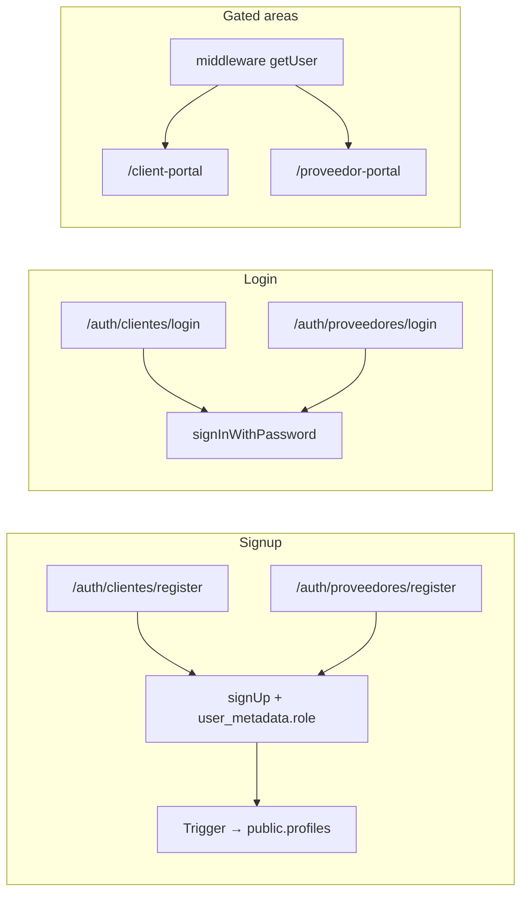

# Auth

> Code: `src/app/auth/`, `src/middleware.ts`, `src/lib/supabase/*`, `src/app/api/auth/callback/route.ts`. Wiki rules: [[SCHEMA]].

## Purpose

Sign-in, self-service registration (clientes + proveedores), email verification, and password reset using **Supabase Auth**, with **one user pool** and **role separation** in Postgres (`public.profiles` + role-specific profile tables).

## How It Works

1. **Register:** Browser `createSPASassClient()` → `registerEmail`; metadata includes `role: 'cliente'` or `'proveedor'` plus name/ID fields. Supabase creates `auth.users`; DB trigger inserts `public.profiles`.
2. **Verify email:** User follows link → `/api/auth/callback` exchanges code → redirect default `/client-portal` unless `next` query says otherwise; resend UI at `/auth/verify-email?back=…`.
3. **Login:** Same SPA client → `signInWithPassword` → redirect to `/client-portal` or `/proveedor-portal`.
4. **Session refresh:** `src/lib/supabase/middleware.ts` runs on portal matchers; unauthenticated users redirect to the correct login route.
5. **Logout:** `SassClient.logout(redirectTo?)` — client portal button uses default cliente login; proveedor button passes proveedor login URL.

## Schema / Data

| Object | Purpose |
|--------|---------|
| `auth.users` / `auth.sessions` | Supabase-managed identity |
| `public.profiles` | One row per user: `id` (FK auth.users), `role` in (`cliente`,`proveedor`) |
| `public.clientes` | Profile fields for buyers (same column shape as proveedores) |
| `public.proveedores` | Profile fields for suppliers |

RLS: each table allows the signed-in user to access **own** row; `clientes` / `proveedores` policies also require matching `profiles.role`.

**Note:** Row inserts into `clientes` / `proveedores` after signup may still need an app or DB trigger if you want profile rows created automatically; today metadata is on the user at signup.

## Dependencies

- `src/lib/supabase/client.ts`, `server.ts`, `unified.ts` (`SassClient`)
- [[features/client-portal|client portal]], [[features/proveedor-portal|proveedor portal]]
- [[ARCHITECTURE]] — exact route list and file tree

## Failure Cases

- **Wrong portal:** User with `proveedor` role can still hit `/client-portal` if only session is checked — add explicit role checks when hardening.
- **Email not confirmed:** Login error until user completes verification (Supabase setting).
- **Prerender:** Pages using `useSearchParams` must use `<Suspense>` (forgot-password, verify-email).

## Key Decisions

- **One Supabase project, one `auth.users` pool** — roles in `public.profiles`, not separate projects.
- **Trigger reads `raw_user_meta_data` once at insert** for `role`; ongoing authorization should use `profiles`, not editable JWT user_metadata for security-sensitive rules.

## Links

- [[ARCHITECTURE]] — routes, middleware, Supabase client files
- [[SCHEMA]] — wiki maintenance and post-ship checklist
- [[OVERVIEW]] — env vars and high-level route list
- [[logs/session-2026-04-26]]
