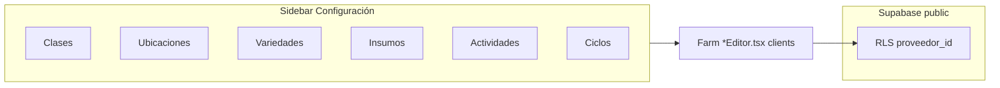

# Proveedor portal

> Follow the feature template in [[SCHEMA]]. App route: `/proveedor-portal` (gated: middleware + Supabase session). Sidebar nav includes **Mi Finca** (`/proveedor-portal/farm/…`) with a **Configuración** collapsible group for crop catalogs.

## Purpose

Give **proveedor** (`profiles.role = proveedor`) a signed-in area for supplier workflows. Today this includes **Mi Finca**: tenant-scoped farm catalogs and operations backed by Supabase (`proveedor_id` + RLS). See [[DATABASE]] for table relationships.

## How It Works

1. User signs in at `/auth/proveedores/login`; middleware allows `/proveedor-portal/*` only when the session is valid.
2. **Layout** (`src/app/proveedor-portal/layout.tsx`) wraps portal pages (sidebar, header, `ConfirmProvider`).
3. **Farm** routes live under `/proveedor-portal/farm/*`. The sidebar **CollapsibleGroup** labelled *Configuración* (or equivalent farm catalog group) links to catalog pages: Clases, Ubicaciones, Variedades, Insumos, Actividades, Ciclos; other farm items (e.g. Producción) may still show *Pronto* placeholders.

### Implemented catalog behaviour (2026-04)

| Page | Route | Behaviour |
|------|-------|-----------|
| Clases | `/proveedor-portal/farm/catalogos/clases` | `ClasesEditor` — CRUD `clases_cultivo` |
| Ubicaciones | `…/ubicaciones` | `UbicacionesEditor` |
| Variedades | `…/variedades` | `VariedadesEditor` — modal CRUD; **Generar ciclos** runs `generarCiclosProduccion` in-modal (same confirm copy as Ciclos page); **Editar ciclos** navigates to Ciclos with `?variedad=` |
| Insumos | `…/insumos` | `InsumosEditor` |
| Actividades | `…/actividades` | `ActividadesEditor` — filter by clase or variedad; table + modal CRUD on `actividades`; when *Requiere insumos*, inline panel edits `insumos_json` (catalog lines: id, nombre, cantidad por planta, unidad) |
| Ciclos | `…/ciclos` | `CiclosProduccionEditor` — `?variedad=<uuid>` pre-selects variety; **Regenerar** / **Generar** use RPC-shaped client `generarCiclosProduccion`; **Eliminar todos** clears `ciclo_produccion` for that variedad and sets `variedades.tiene_ciclos_produccion = false` |

### Shared UI: `Select`

`src/components/Common/Select.tsx` wraps a native `<select>` with Siberian Teal focus ring, hover border, and a custom chevron. **The opened option list is still the browser/OS native menu** — styling that list requires a custom combobox (e.g. Radix Select), not done in this repo yet.

## Schema / Data

- **Tables:** `clases_cultivo`, `ubicaciones`, `variedades`, `insumos`, `actividades`, `ciclo_produccion`, etc. — all scoped by `proveedor_id`. See [[DATABASE]].
- **`actividades`:** `insumos_json` is `text` storing a JSON array of `{ id, nombre, cantidad_por_planta, unidad_medida_por_planta }` aligned with the legacy FarmPanel sheet model.
- **`ciclo_produccion`:** rows per `id_variedad`; `deleteAllCiclosByVariedad` in `src/lib/farm/ciclos.ts` deletes all rows for a variety and clears the flag on `variedades`. When **generating** cycles, `nro_semana` runs **inclusive** from `semana_inicio_corte` through `ciclo_en_semanas` (first row = start week, not start+1; count = `ciclo - inicio + 1`).

## Dependencies

- [[features/auth|Auth]] — proveedor login and `profiles.role`
- [[DATABASE]] — Mi Finca tables and RLS intent
- [[ARCHITECTURE]] — `src/app/proveedor-portal/`, `src/components/Farm/`, `src/lib/farm/`
- `src/lib/supabase/*` — browser + server clients

## Failure Cases

- **Actividades / insumos:** If the insumo catalog is empty, the UI links users to the Insumos catalog page; generation of activities still works without insumo lines.
- **Ciclos generate from Variedades modal:** Requires `ciclo_en_semanas` and `semana_inicio_corte` valid on the variety; otherwise an inline error banner is shown (no navigation).
- **Native select dropdown:** Cannot be themed; only the closed control is branded via `Select`.

## Key Decisions

- **Reuse `generarCiclosProduccion` from Variedades** so bell-curve logic stays in one place (`src/lib/farm/ciclos.ts`) instead of duplicating in the modal.
- **Deep link** `/farm/catalogos/ciclos?variedad=` for fine-grained editing of weekly rows after bulk generation.
- **`Select` without Radix** keeps dependencies minimal; trade-off is native dropdown appearance for options.

## Links

- [[ARCHITECTURE]] — folder map and route table
- [[DATABASE]] — `actividades`, `ciclo_produccion`, `variedades`
- [[OVERVIEW]] — brand tokens used by `Select` (primary teal)
- [[roadmap/index]] — future portal work
